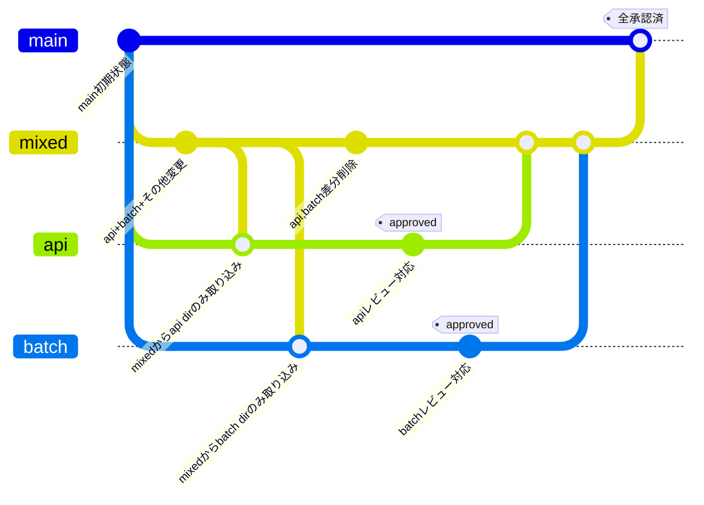

今回、肥大化したPRをレビュワーへの負担軽減やPRの粒度を小さくするためにブランチを途中で分離させる方法を記載します。

## 今回のケース
mixedブランチ(様々なレイヤーの変更が盛り込まれているブランチ)を
- apiブランチ
- batchブランチ

へ分離する。
そして、最終的にmixedブランチに対して、api・batchがapproveされた状態でマージさせたい。

こうすることで、複雑なmixedブランチがmainへマージされる時には全てapproveされたことを担保する。

## 手順
イメージとしては以下のような感じ。


```sh
# apiブランチの作成
git checkout main
git checkout -b api

# mixedブランチからapiディレクトリの変更を取り込み
git pull mixed -- api
git commit -m "merge: mixedからapiの変更を取り込み"
git push -u origin HEAD

# batchブランチの作成
git checkout main
git checkout -b batch

# mixedブランチからbatchディレクトリの変更を取り込み
git pull mixed -- batch
git commit -m "merge: mixedからbatchの変更を取り込み"
git push -u origin HEAD

# mixedブランチからapi, batchディレクトリの差分削除
git checkout mixed
git restore --source=main api batch
git commit -m "revert: api, batch処理分離に伴う差分削除"
git push
```

これで無事にapi, batchディレクトリの差分分けが完了しましたとさ。
mixedブランチには今までの差分が保持されるので、まとめてresetするよりも安全かなと思います。

最適解ではないと思うので、参考にされる場合は自己責任でお願いします！
